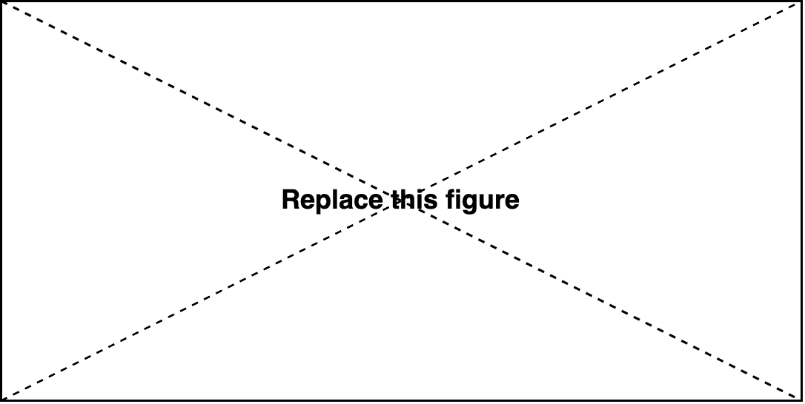

Just Code
=========

Key goals
---------
.. _goals:

* goal 1
    * goal 1.1
* goal 2
* goal 3

#. aim 1
#. aim 2
#. aim 3

.. caution::
    some texts here some texts here some texts here some texts here some texts here

.. tip::
    some texts here some texts here some texts here some texts here some texts here

.. note::
    some texts here some texts here some texts here some texts here some texts here

.. important:: 
    some texts here some texts here some texts here some texts here some texts here

.. warning:: 
    some texts here some texts here some texts here some texts here some texts here

.. hint:: 
    some texts here some texts here some texts here some texts here some texts here

.. danger:: 
    some texts here some texts here some texts here some texts here some texts here

Options
---------

Hyperlinks
~~~~~~~~~~

https://www.google.com/

`google <https://www.google.com/>`_

:doc:`/options/justlogic`

:doc:`Custom text </options/justlogic>`

:ref:`go to the goals <goals>`

Tables
~~~~~~~~

==== ==== ====
cell cell cell
==== ==== ====
cell cell cell
cell cell cell
cell cell cell
==== ==== ====

.. table:: Table 1

    ==== ==== ====
    cell cell cell
    ==== ==== ====
    cell cell cell
    cell cell cell
    cell cell cell
    ==== ==== ====

.. csv-table:: Comparison
    :header: head1, head2, head3
    :widths: 10, 10, 10

    cell1, cell2, cell3
    cell1, cell2, cell3

Code
~~~~

Here is some code::

    from matplotlib import pyplot as plt

Here is some Python code:

.. code-block:: Python

    from matplotlib import pyplot as plt

Images
~~~~~~

.. image:: /images/place-holder.png

